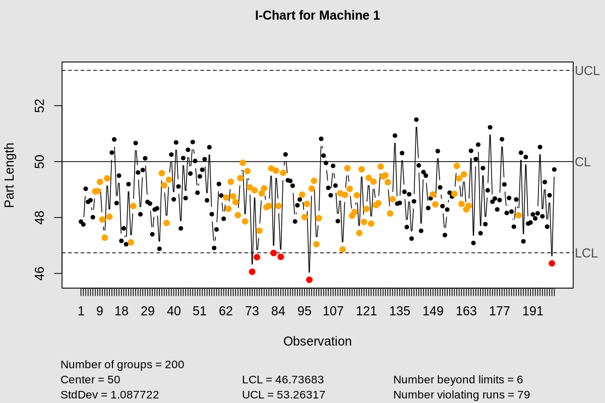
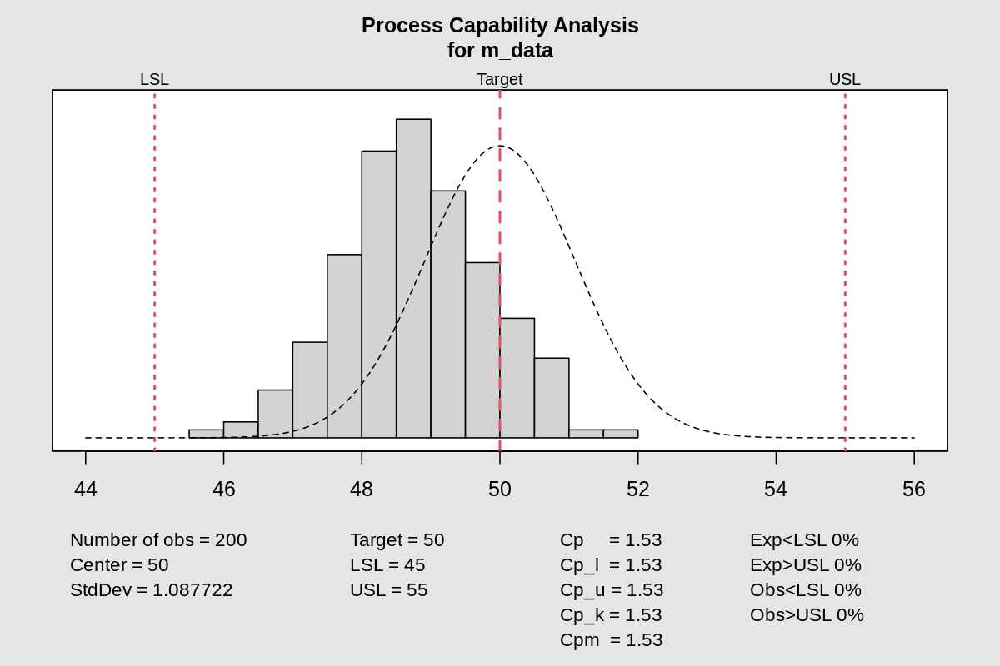
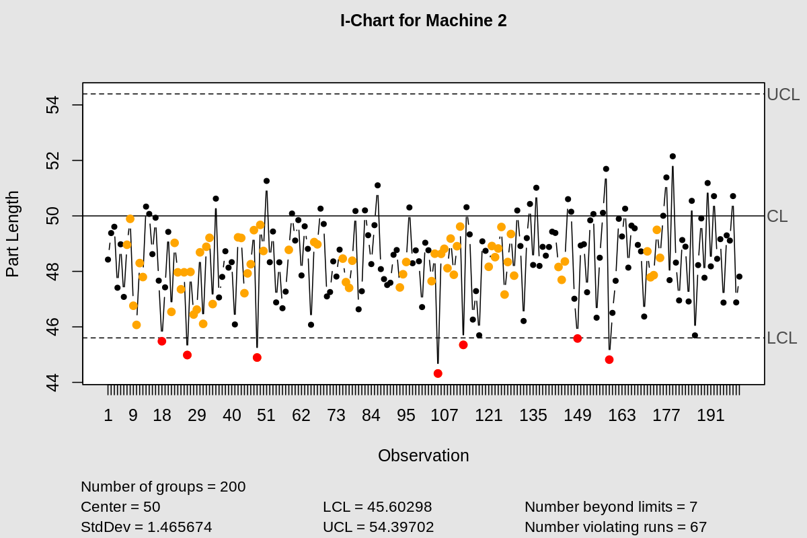
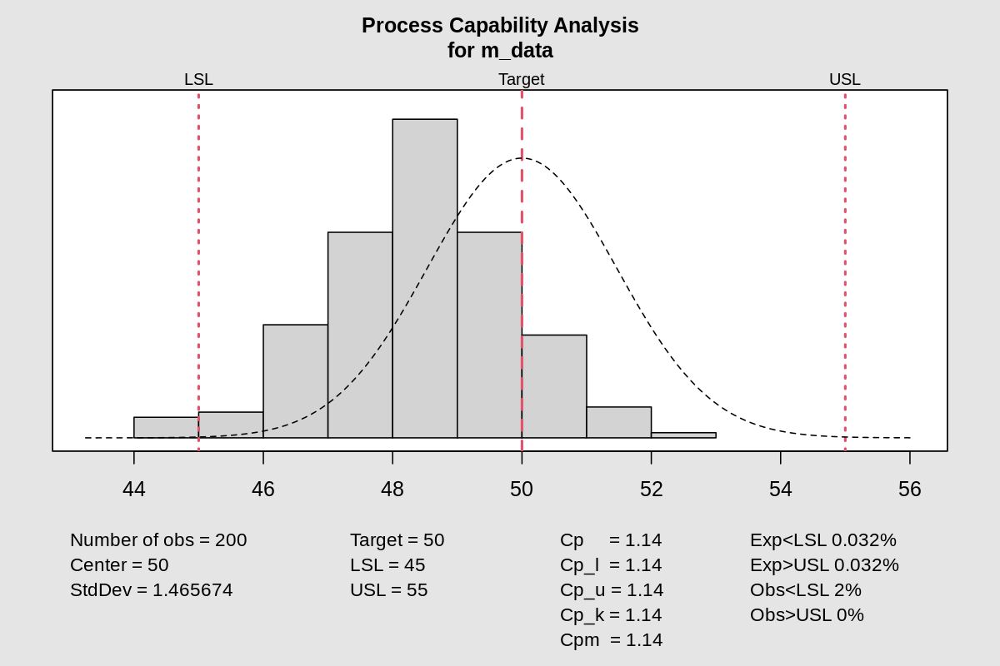
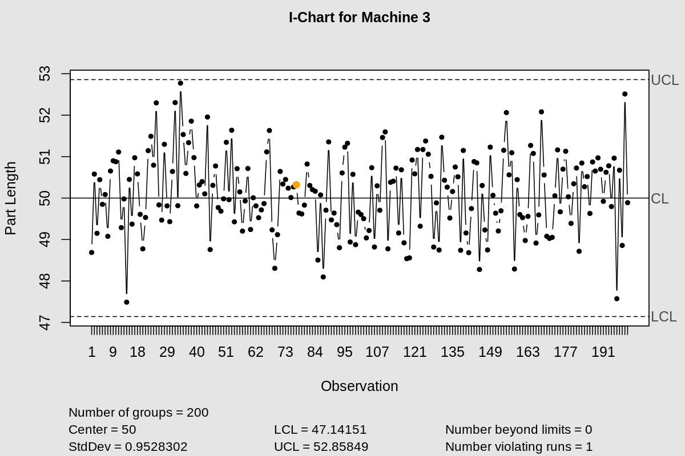
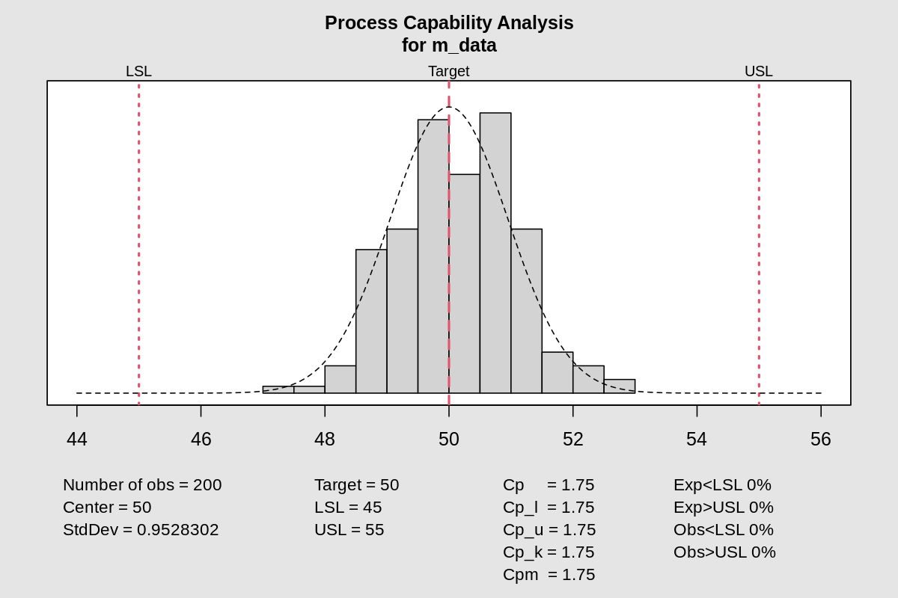

:::: {.columns}
::: {.column width="50%"}

## Machine Performance Analysis
#### Specs: LSL=45, Target=50, USL=55
#### Pressure: 200kPa | Temp: 338K

:::

::: {.column width="50%"}

:::

::::

---

:::: {.columns}
::: {.column width="50%"}
### Machine 1 Stability
**I-Chart Analysis:**
- Individual measurements evaluation.
- 3-$\sigma$ control limits applied.
:::

::: {.column width="50%"}

:::

::::

---

:::: {.columns}
::: {.column width="50%"}
### Machine 1 Capability
**Statistical Summary:**
- Capability vs Target 50.
- Limits: [45, 55].
:::

::: {.column width="50%"}

:::

::::

---

:::: {.columns}
::: {.column width="50%"}
### Machine 2 Stability
**I-Chart Analysis:**
- Monitoring stability for Machine 2.
:::

::: {.column width="50%"}

:::

::::

---

:::: {.columns}
::: {.column width="50%"}
### Machine 2 Capability
**Statistical Summary:**
- Distribution vs Specification Limits [45, 55].
:::

::: {.column width="50%"}

:::

::::

---

:::: {.columns}
::: {.column width="50%"}
### Machine 3 Stability
**I-Chart Analysis:**
- Monitoring stability for Machine 3.
:::

::: {.column width="50%"}

:::

::::

---

:::: {.columns}
::: {.column width="50%"}
### Machine 3 Capability
**Statistical Summary:**
- Distribution vs Specification Limits [45, 55].
:::

::: {.column width="50%"}

:::

::::

---
# Bibliography

